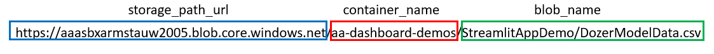
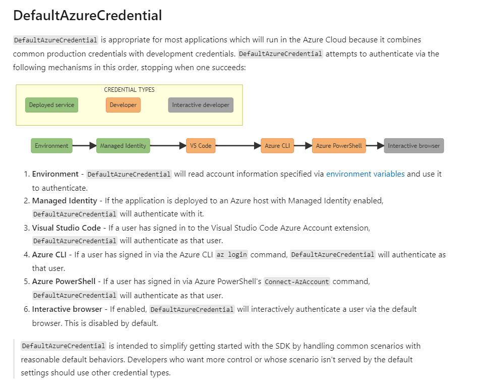

Script demonstrating how to read various file formats from Azure storage blob using Azure Python SDK

<!-- GETTING STARTED -->
## Getting Started

To get started do the following :smiley:

1. Open a shell and clone the `main` branch of this repo - navigate to this folder (AzureUtilities)

   ```sh
   git clone https://github.com/dhurley-suncor/code-snippets.git
   ```
2. Open a shell, create a virtual environment, and install the required dependencies. Below I show an example with Conda. You can also use VENV and Pipenv - just run the `pip install -r requirements.txt` after creation.

     ```sh
     conda create --name MYENV
     conda activate MYENV
     pip install -r requirements.txt
     ```  
3. Rename `.env-template` to `.env`

4. Update the variables in `.env` to reflect your specific site. MAKE SURE `.env` IS IN THE `.gitignore` FILE!!! DON'T SEND TO VERSION CONTROL!!! Update the container name and blob name in `run.py`. Images below show file path naming convention. 



5. Run the script 

  ```sh
  python run.py
  ```
  
6. If succesful you will see data print out

<!-- AZURE AUTHENTICATION -->
## Azure Authentication
This method uses the DefaultAzureCredential to authenticate to Azure. It tries 6 methods, the first 2 are available in deployment and the next 4 are available when developing locally (see image below). If you use Visual Studio Code and the Azure plugin this will make authenticating MUCH EASIER! [Docs Here](https://docs.microsoft.com/en-us/python/api/overview/azure/identity-readme?view=azure-python)




