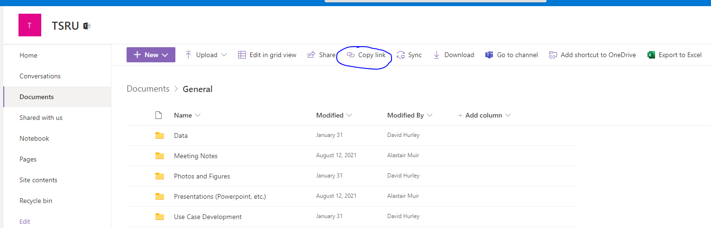
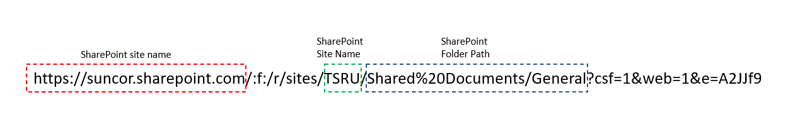

Script demonstrating how to push files to Sharepoint using SharePlum and Office365 authentication. SharePlum has other methods such as pull. 

<!-- GETTING STARTED -->
## Getting Started

To get started do the following :smiley:

1. Open a shell and clone the `main` branch of this repo - navigate to this folder (SharepointShareplumDemo)

   ```sh
   git clone https://github.com/dhurley-suncor/code-snippets.git
   ```
2. Open a shell, create a virtual environment, and install the required dependencies. Below I show an example with Conda. You can also use VENV and Pipenv - just run the `pip install -r requirements.txt` after creation.

     ```sh
     conda create --name MYENV
     conda activate MYENV
     pip install -r requirements.txt
     ```  
3. Rename `.env-template` to `.env`

4. Update the variables in `.env` to reflect your specific site. MAKE SURE `.env` IS IN THE `.gitignore` FILE!!! DON'T SEND TO VERSION CONTROL!!!
The `.env` variables should be entered as show in the image below. 




5. Run the script 

  ```sh
  python sharepoint_test.py
  ```
  
6. If succesful you will see an image uploaded to the SharePoint folder path
